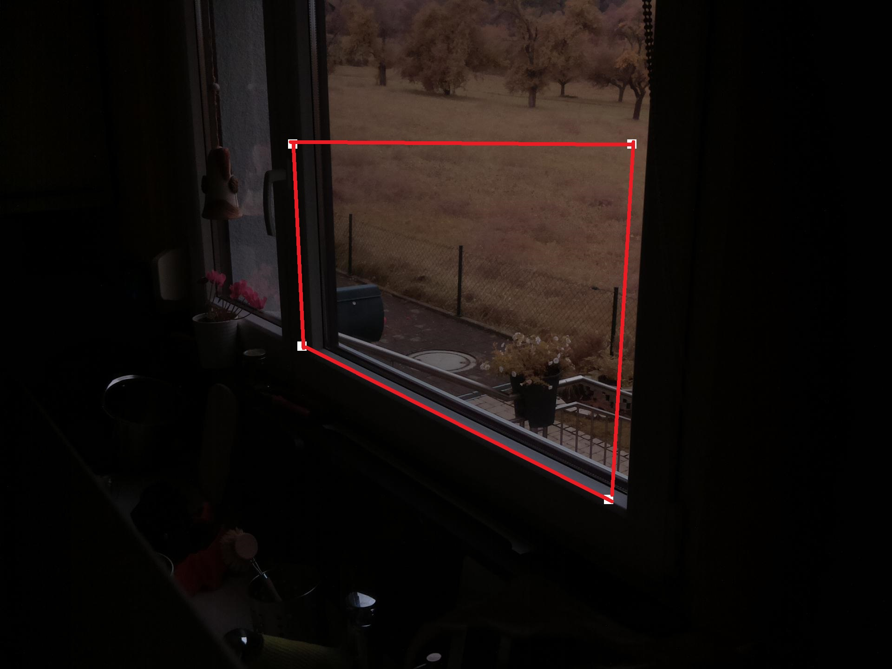
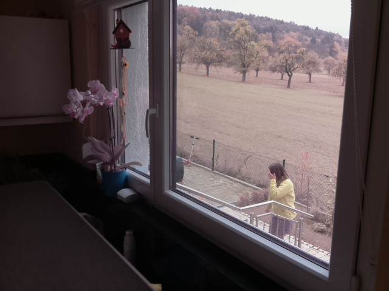
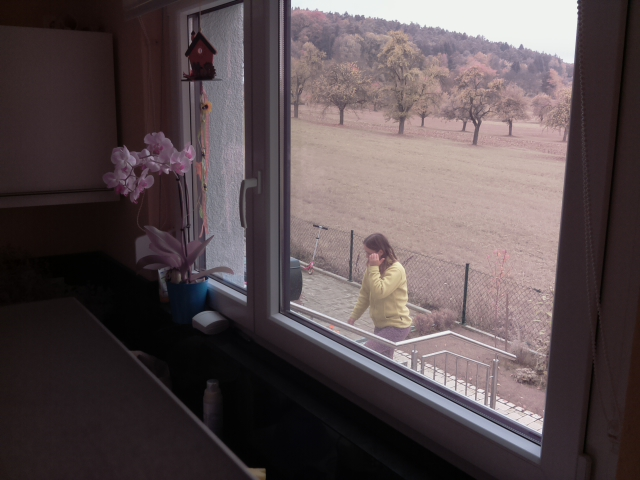
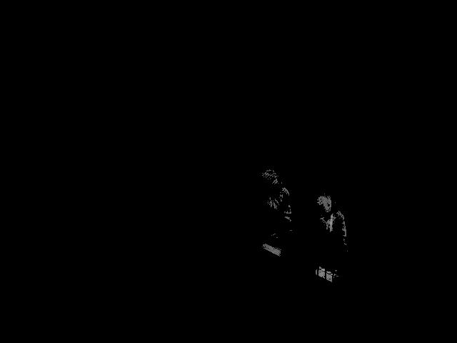

<!-- https://code.visualstudio.com/docs/languages/markdown 
preview in Visual Studio Code: Ctrl + Shift + V
-->

# SurveillanceApplication

This project implements a home surveillance application intended to store images of motion (e.g. moving/walking persons in the region of interest) on a Raspberry Pi. Using a cron job running cyclically in the background allows for uploading to a private webspace (cron job configuration is not part of the repository). The stored images are only available for personal use (e.g. to see who was in front of my house). All images are not publically available and are deleted automatically after a few days.

The region of interest (region in the image where the application is sensitive to motion) can be configured and parameterized via a web browser interface, e.g.

## Basic working principle

The underlying concept uses differences in consecutive images which I implemented in my Master's Thesis at the University of Rhode Island in 2008 (*Active Motion Tracking Camera Implemented as an Embedded System*). There might be more complicated approaches available but this technique is completely sufficiant to fullfill the requirements for a home suveillance application.

The complete application was developed in Python allowing to use great openly available toolboxes, e.g. for image processing.

